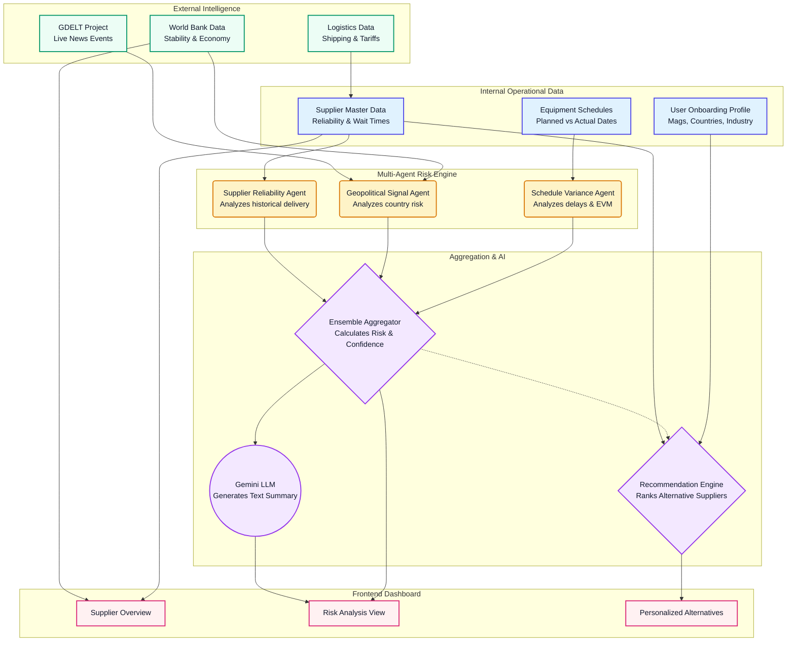

# SentriChain Data Flow Diagram

This diagram maps out how data travels from internal and external sources through the multi-agent engine to eventually reach the user's dashboard. You can view this natively in VS Code if you have a Markdown Preview Mermaid extension installed, or paste it into [Mermaid Live Editor](https://mermaid.live).

## How to Explain This (No-Math Presentation Script)

1. **Left Side (The Inputs)**
   "Our system pulls from two main buckets. The top bucket is the company's own data—what they buy, who they buy from, and when deliveries are scheduled. The bottom bucket is live global data—World Bank economic stability, logistics indices, and breaking news events from GDELT."

2. **Middle (The Agents)**
   "All this data feeds into our three independent agents. One agent watches the clock for schedule slips, another watches the globe for political instability, and the third reviews the supplier's historical track record."

3. **Right Side (The Output)**
   "The agents cast their votes to an 'Ensemble Aggregator' that reaches a final consensus. That consensus risk score, along with customized supplier recommendations matching the user's initial onboarding profile, gets pushed straight to the procurement manager's dashboard."
